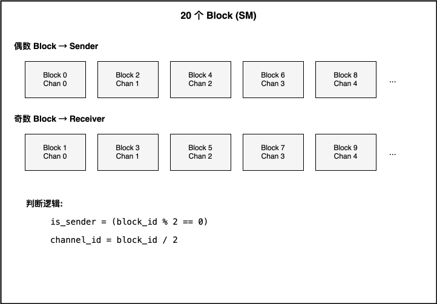
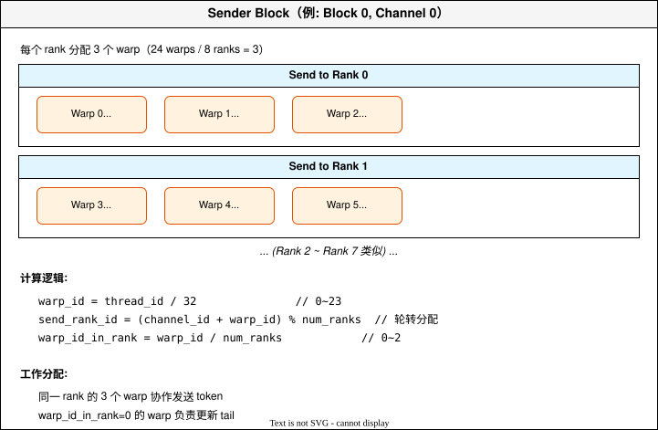
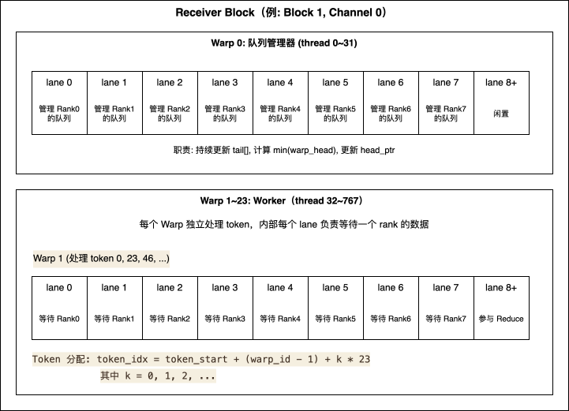

# DeepEP Intranode Combine 核心逻辑

## 概述

DeepEP 的 Intranode Combine 实现了单节点内多 GPU 之间的 MoE token 聚合。核心目标是：**把各 GPU 上 expert 处理完的结果发回原始 token 所在的 GPU，并进行 reduce 求和**。

### 为什么需要 Combine？

MoE 模型中，一个 token 可能选择了 top-k 个 expert，这些 expert 可能分布在不同的 GPU 上。Dispatch 阶段把 token 发送到各个 expert 所在的 GPU 进行 FFN 计算，Combine 阶段需要：
1. 把各 GPU 的计算结果发回原始 token 所在的 GPU
2. 对来自多个 expert 的结果进行 reduce 求和
3. 输出最终的 token embedding

### 核心设计

```
─────────────────────────────────────────────────────────────────
                      Intranode Combine 设计                      
─────────────────────────────────────────────────────────────────
  1. 数据流向：与 Dispatch 相反                                   
     - Dispatch: 原始 token → expert 所在的 GPU                  
     - Combine:  expert 处理结果 → 原始 token 所在的 GPU          
                                                                 
  2. 关键差异：Combine 需要 Reduce                               
     - Dispatch: 一对一传输（token → expert）                    
     - Combine:  多对一聚合（多个 expert 结果 → 一个 token）       
                                                                 
  3. 定位机制：依赖 send_head                                     
     - Dispatch 阶段记录每个 token 被写入的 slot 位置             
     - Combine 阶段用这个位置来定位数据来源                       
                                                                 
  4. SM 分工：与 Dispatch 相同                                    
     - 偶数 SM 做 Sender（写远程 Buffer）                         
     - 奇数 SM 做 Receiver（从本地 Buffer 读取并 Reduce）         
─────────────────────────────────────────────────────────────────
```

---

## 调用链

```
buffer.combine()                     [Python: deep_ep/buffer.py:405-450]
    │
    ├─► cached_notify_combine()      [预处理 send_head，填充 -1 值]
    │                                [intranode.cu:612-689]
    │
    └─► combine()                    [实际数据传输 + Reduce]
                                     [intranode.cu:691-1099]
```

---

## 核心数据结构

### Dispatch 传递给 Combine 的 Handle

```python
# buffer.py:398
handle = (
    rank_prefix_matrix,         # [num_ranks, num_ranks] int
    channel_prefix_matrix,      # [num_ranks, num_channels] int
    recv_channel_prefix_matrix, # [num_ranks, num_channels] int
    recv_src_idx,               # [num_recv_tokens] int
    is_token_in_rank,           # [num_tokens, num_ranks] bool
    send_head                   # [num_recv_tokens, num_ranks] int  ← 最关键
)
```

### send_head 的含义

```
send_head[token_idx * num_ranks + rank_id]:
    >= 0: dispatch 时，token_idx 被写入 rank_id 的 buffer 的 slot 位置
    <  0: token_idx 不从 rank_id 接收数据，值为 -(last_valid_head) - 1
         （由 cached_notify_combine 预处理填充）
```

### Combine 的 Buffer 内存布局

```
每个 Rank 的 Buffer（存储发给自己的数据）：
┌─────────────────────────────────────────────────────────────────────────────┐
│ 偏移量                                                                       │
├─────────────────────────────────────────────────────────────────────────────┤
│ 0                                                                           │
│ ├── head_idx[num_channels * num_ranks]        // int, Receiver 更新         │
│                                                                             │
│ num_channels * num_ranks * 4                                                │
│ ├── tail_idx[num_channels * num_ranks]        // int, Sender 更新            │
│                                                                             │
│ num_channels * num_ranks * 8                                                │
│ ├── x_buffer[num_channels * num_ranks * num_slots * hidden_int4]  // int4   │
│                                                                             │
│ ... (x_buffer 之后)                                                         │
│ ├── src_idx_buffer[num_channels * num_ranks * num_slots]          // int    │
│                                                                             │
│ ... (src_idx_buffer 之后)                                                   │
│ ├── topk_weights_buffer[num_channels * num_ranks * num_slots * num_topk]    │
└─────────────────────────────────────────────────────────────────────────────┘

索引计算:
  channel_rank_offset = channel_id * num_ranks + src_rank_id
  head_idx[channel_rank_offset]                     → 第 channel_rank_offset 个队列的 head
  tail_idx[channel_rank_offset]                     → 第 channel_rank_offset 个队列的 tail
  x_buffer[channel_rank_offset * num_slots + slot]  → 第 channel_rank_offset 个队列的第 slot 个数据
```

---

## Kernel 线程分配

### 配置参数

```
num_sms = 20           // 启动 20 个 block
num_threads = 768      // 每个 block 768 个 thread
num_ranks = 8          // 8 个 GPU
num_channels = 10      // num_sms / 2
num_warps = 24         // 768 / 32
```

### Block 分配



### Sender Block 内部（768 threads = 24 warps）



### Receiver Block 内部（768 threads = 24 warps）



---

## Combine Kernel 核心逻辑

### 共享内存结构

```cpp
// intranode.cu:834-838
__shared__ volatile int warp_head[num_recv_warps][num_ranks];  // 每个 worker warp 的处理进度
__shared__ volatile int tail[num_ranks];                       // 从各 sender 读取的最新 tail
__shared__ volatile bool warp_retired[num_recv_warps];         // warp 是否处理完毕

// 初始化
warp_retired[warp_id] = false;
warp_head[warp_id][lane_id] = 0;   // lane_id < num_ranks
tail[thread_id] = 0;               // thread_id < num_ranks
```

### Sender 逻辑（intranode.cu:732-824）

```cpp
// ===== Sender: 将本地 expert 处理结果发送到目标 rank 的 buffer =====

// 1. 计算本 warp 负责的任务范围
//    rank_offset: 前面所有 rank 发给 send_rank_id 的累计 token 数
//    channel_offset: 本 channel 在 send_rank_id 内的起始位置
int rank_offset = (send_rank_id > 0)
    ? rank_prefix_matrix[(send_rank_id - 1) * num_ranks + my_rank] : 0;
int num_rank_tokens = rank_prefix_matrix[send_rank_id * num_ranks + my_rank] - rank_offset;
int channel_offset = channel_prefix_matrix[send_rank_id * num_channels + channel_id];
int num_channel_tokens = next_channel_offset - channel_offset;
int token_start = rank_offset + channel_offset;
int token_end = token_start + num_channel_tokens;

// 2. 获取远程 buffer 指针（写入 send_rank_id 的显存）
int* remote_head_ptr = buffer_ptrs[send_rank_id] + channel_rank_offset;
int* remote_tail_ptr = remote_head_ptr + num_channels * num_ranks;
int4* remote_x_ptr = ...;

// 3. 发送循环
int local_tail = 0;
for (int token_idx = token_start; token_idx < token_end; ) {
    // 3a. 流量控制：等待 Receiver 腾出空间
    while (true) {
        int remote_head = ld_volatile_global(remote_head_ptr);
        int used_slots = local_tail - remote_head;
        if (num_slots - used_slots >= num_round_tokens)
            break;
    }

    // 3b. 批量发送
    for (int i = warp_id_in_rank; i < num_round_tokens; i += num_warps_per_rank) {
        int slot = (local_tail + i) % num_slots;

        // 写入 x 数据（warp 内 32 个 lane 并行写 hidden 维度）
        int4* dst = remote_x_ptr + slot * hidden_int4;
        int4* src = x_int4 + (token_idx + i) * hidden_int4;
        for (int j = lane_id; j < hidden_int4; j += 32)
            st_na_global(dst + j, ld_nc_global(src + j));

        // 写入 src_idx
        if (lane_id == 0)
            remote_src_idx[slot] = src_idx[token_idx + i];

        // 写入 topk_weights
        if (lane_id < num_topk)
            remote_weights[slot * num_topk + lane_id] = topk_weights[(token_idx + i) * num_topk + lane_id];
    }

    local_tail += num_round_tokens;
    token_idx += num_round_tokens;

    // 3c. 同步后更新 tail
    barrier_within_rank();
    if (warp_id_in_rank == 0 && lane_id == 0)
        st_release_sys_global(remote_tail_ptr, local_tail);
}
```

### Receiver Warp 0: 队列管理器（intranode.cu:845-871）

```cpp
// ===== Warp 0: 持续更新队列状态 =====

int* local_head_ptr = buffer_ptrs[my_rank] + channel_id * num_ranks + lane_id;
int* local_tail_ptr = local_head_ptr + num_channels * num_ranks;

int last_head = 0;
while (lane_id < num_ranks) {
    // 检查是否所有 worker warp 都退休了
    bool all_retired = true;
    for (int i = 1; i < num_recv_warps; i++)
        all_retired &= warp_retired[i];
    if (all_retired)
        break;

    // 更新 tail（从 sender 读取，acquire 语义）
    tail[lane_id] = ld_acquire_sys_global(local_tail_ptr);

    // 计算所有 worker warp 的最小 head
    int min_head = INT_MAX;
    for (int i = 1; i < num_recv_warps; i++)
        if (!warp_retired[i])
            min_head = min(min_head, warp_head[i][lane_id]);

    // 更新 head（让 sender 知道可以复用 slot）
    if (min_head > last_head) {
        st_relaxed_sys_global(local_head_ptr, min_head);
        last_head = min_head;
    }
}
```

### Receiver Warp 1~23: Worker（intranode.cu:872-1029）

```cpp
// ===== Worker Warp: 接收数据 + Reduce =====

// 计算本 channel 负责的 token 范围
int token_start, token_end;
get_channel_task_range(num_recv_tokens, num_channels, channel_id, token_start, token_end);

// 获取本地 buffer 指针数组（从各 rank 读取）
int4* local_x_ptr[num_ranks];
float* local_weights_ptr[num_ranks];
for (int r = 0; r < num_ranks; r++) {
    int offset = channel_id * num_ranks + r;
    local_x_ptr[r] = ...;
    local_weights_ptr[r] = ...;
}

// 遍历每个 token（warp 间交错分配）
for (int token_idx = token_start + warp_id - 1; token_idx < token_end; token_idx += num_recv_warps - 1) {

    // Step 1: 读取 expected_head（dispatch 阶段记录的 slot 位置）
    //         每个 lane 读自己负责的 rank
    int expected_head = -1;
    if (lane_id < num_ranks)
        expected_head = send_head[token_idx * num_ranks + lane_id];

    // Step 2: 等待所有需要的 rank 的数据到达
    //         __any_sync: 只要任意一个 lane 还在等，整个 warp 继续等
    while (__any_sync(0xffffffff, tail[lane_id] <= expected_head && expected_head >= 0)) {
        // 继续等待
    }

    // Step 3: 确定哪些 rank 有数据（用 __shfl_sync 广播）
    int num_src_ranks = 0;
    int src_ranks[num_ranks];
    int slots[num_ranks];
    for (int r = 0; r < num_ranks; r++) {
        int head_r = __shfl_sync(0xffffffff, expected_head, r);  // 广播 lane r 的值
        if (head_r >= 0) {
            src_ranks[num_src_ranks] = r;
            slots[num_src_ranks] = head_r % num_slots;
            num_src_ranks++;
        }
    }

    // Step 4: Reduce（所有 32 个 lane 并行处理 hidden 维度的不同部分）
    for (int i = lane_id; i < hidden_int4; i += 32) {
        // 读取 bias
        int4 bias_0_val = bias_0 ? __ldg(bias_0 + token_idx * hidden_int4 + i) : make_int4(0,0,0,0);
        int4 bias_1_val = bias_1 ? __ldg(bias_1 + token_idx * hidden_int4 + i) : make_int4(0,0,0,0);

        // 初始化为 bias 之和
        float values[4];
        for (int k = 0; k < 4; k++)
            values[k] = ((bfloat16*)&bias_0_val)[k] + ((bfloat16*)&bias_1_val)[k];

        // 累加各 rank 的数据
        for (int j = 0; j < num_src_ranks; j++) {
            int4 data = ld_nc_global(local_x_ptr[src_ranks[j]] + slots[j] * hidden_int4 + i);
            for (int k = 0; k < 4; k++)
                values[k] += ((bfloat16*)&data)[k];
        }

        // 写入结果
        int4 out;
        for (int k = 0; k < 4; k++)
            ((bfloat16*)&out)[k] = values[k];
        recv_x[token_idx * hidden_int4 + i] = out;
    }

    // Step 5: Reduce topk_weights
    if (lane_id < num_topk) {
        float weight_sum = 0;
        for (int j = 0; j < num_src_ranks; j++)
            weight_sum += ld_nc_global(local_weights_ptr[src_ranks[j]] + slots[j] * num_topk + lane_id);
        recv_topk_weights[token_idx * num_topk + lane_id] = weight_sum;
    }

    // Step 6: 更新本 warp 的 head 进度
    if (lane_id < num_ranks) {
        int new_head = (expected_head < 0) ? (-expected_head - 1) : (expected_head + 1);
        warp_head[warp_id][lane_id] = new_head;
    }
}

// 标记退休
if (lane_id == 0)
    warp_retired[warp_id] = true;
```

---

## 完整示例

### 场景设定

```
- 2 个 GPU：Rank 0, Rank 1
- 4 个 token：T0, T1, T2, T3
- top-2 routing
- 4 个 expert：Rank 0 拥有 E0, E1；Rank 1 拥有 E2, E3
```

### Dispatch 后的状态

```
Routing 结果:
    T0 选 E0, E2 → 发给 Rank 0 和 Rank 1
    T1 选 E1, E3 → 发给 Rank 0 和 Rank 1
    T2 选 E2, E3 → 只发给 Rank 1
    T3 选 E0, E1 → 只发给 Rank 0

Dispatch 后各 Rank 的数据:
    Rank 0 有: T0→E0 的输入, T1→E1 的输入, T3→E0 的输入, T3→E1 的输入
    Rank 1 有: T0→E2 的输入, T1→E3 的输入, T2→E2 的输入, T2→E3 的输入

send_head 记录（Dispatch 阶段填写）:
    send_head[T0, R0] = 0    // T0 在 R0 的 buffer slot 0
    send_head[T0, R1] = 0    // T0 在 R1 的 buffer slot 0
    send_head[T1, R0] = 1    // T1 在 R0 的 buffer slot 1
    send_head[T1, R1] = 1    // T1 在 R1 的 buffer slot 1
    send_head[T2, R0] = -2   // T2 不从 R0 接收（负数编码）
    send_head[T2, R1] = 2    // T2 在 R1 的 buffer slot 2
    send_head[T3, R0] = 2    // T3 在 R0 的 buffer slot 2
    send_head[T3, R1] = -3   // T3 不从 R1 接收（负数编码）
```

### FFN 计算后

```
Rank 0 Expert 计算完成:
    slot 0: T0→E0 的结果
    slot 1: T1→E1 的结果
    slot 2: T3→E0 的结果
    slot 3: T3→E1 的结果

Rank 1 Expert 计算完成:
    slot 0: T0→E2 的结果
    slot 1: T1→E3 的结果
    slot 2: T2→E2 的结果
    slot 3: T2→E3 的结果
```

### Combine 数据流

```
┌─────────────────────────────────────────────────────────────────────────────┐
│                           Combine 数据流                                     │
├─────────────────────────────────────────────────────────────────────────────┤
│                                                                             │
│  Step 1: Sender 写入 Buffer                                                 │
│  ──────────────────────────────────────────────────────────────────────     │
│                                                                             │
│  Rank 0 的 Sender:                          Rank 1 的 Sender:               │
│    写入 Rank 0 的 Buffer:                     写入 Rank 0 的 Buffer:         │
│      slot 0: T0→E0 结果                         slot 0: T0→E2 结果          │
│      slot 1: T1→E1 结果                         slot 1: T1→E3 结果          │
│      slot 2: T3→E0 结果                                                     │
│      slot 3: T3→E1 结果                                                     │
│                                                                             │
│    写入 Rank 1 的 Buffer (via NVLink):        写入 Rank 1 的 Buffer:         │
│      slot 0: T0→E0 结果                         slot 0: T0→E2 结果          │
│      slot 1: T1→E1 结果                         slot 1: T1→E3 结果          │
│                                                 slot 2: T2→E2 结果          │
│                                                 slot 3: T2→E3 结果          │
│                                                                             │
│  Step 2: Receiver Reduce                                                    │
│  ──────────────────────────────────────────────────────────────────────     │
│                                                                             │
│  Rank 0 的 Receiver 处理 T0:                                                │
│    从 send_head 读取: [R0]=0, [R1]=0                                        │
│    等待 tail[R0] > 0 且 tail[R1] > 0                                        │
│    读取: buffer[R0][0] + buffer[R1][0]                                      │
│    写入: recv_x[T0] = (T0→E0 结果) + (T0→E2 结果)                           │
│                                                                             │
│  Rank 0 的 Receiver 处理 T1:                                                │
│    从 send_head 读取: [R0]=1, [R1]=1                                        │
│    读取: buffer[R0][1] + buffer[R1][1]                                      │
│    写入: recv_x[T1] = (T1→E1 结果) + (T1→E3 结果)                           │
│                                                                             │
│  Rank 0 的 Receiver 处理 T3:                                                │
│    从 send_head 读取: [R0]=2, [R1]=-3（负数，不从 R1 接收）                  │
│    只从 R0 读取: buffer[R0][2] + buffer[R0][3]                              │
│    写入: recv_x[T3] = (T3→E0 结果) + (T3→E1 结果)                           │
│                                                                             │
│  Rank 1 的 Receiver 处理 T2:                                                │
│    从 send_head 读取: [R0]=-2, [R1]=2                                       │
│    只从 R1 读取: buffer[R1][2] + buffer[R1][3]                              │
│    写入: recv_x[T2] = (T2→E2 结果) + (T2→E3 结果)                           │
│                                                                             │
└─────────────────────────────────────────────────────────────────────────────┘
```

### Combine 完成后

```
Rank 0 的 recv_x:
    [T0]: (T0→E0) + (T0→E2) 的聚合结果
    [T1]: (T1→E1) + (T1→E3) 的聚合结果
    [T3]: (T3→E0) + (T3→E1) 的聚合结果

Rank 1 的 recv_x:
    [T2]: (T2→E2) + (T2→E3) 的聚合结果
```

---

## 整体数据流图

```
                          Combine 整体流程

    Rank 0                                           Rank 1
    ┌─────────────────┐                              ┌─────────────────┐
    │ Expert 输出     │                               │ Expert 输出     │
    │ (FFN 计算结果)   │                              │ (FFN 计算结果)    │
    └────────┬────────┘                              └────────┬────────┘
             │                                                │
             ▼                                                ▼
    ┌─────────────────┐                              ┌─────────────────┐
    │ Sender SM       │                              │ Sender SM       │
    │ (偶数 SM)       │                              │ (偶数 SM)        │
    │                 │         NVLink               │                 │
    │ 写入 R0 buffer ─┼─────────────────────────────►│ buffer           │
    │ 写入 R1 buffer ─┼─────────────────────────────►│                  │
    │                 │         NVLink               │                 │
    │ buffer ◄────────┼─────────────────────────────┼─ 写入 R0 buffer   │
    │                 │◄────────────────────────────┼─ 写入 R1 buffer   │
    └─────────────────┘                              └─────────────────┘
             │                                                │
             ▼                                                ▼
    ┌─────────────────┐                              ┌─────────────────┐
    │ Receiver SM     │                              │ Receiver SM     │
    │ (奇数 SM)       │                              │ (奇数 SM)        │
    │                 │                              │                 │
    │ ┌─────────────┐ │                              │ ┌─────────────┐ │
    │ │ Warp 0:     │ │                              │ │ Warp 0:     │ │
    │ │ 队列管理器    │ │                              │ │ 队列管理器    │ │
    │ └─────────────┘ │                              │ └─────────────┘ │
    │ ┌─────────────┐ │                              │ ┌─────────────┐ │
    │ │ Warp 1~23:  │ │                              │ │ Warp 1~23:  │ │
    │ │ Reduce      │ │                              │ │ Reduce      │ │
    │ │ 等待+求和     │ │                              │ │ 等待+求和    │ │
    │ └─────────────┘ │                              │ └─────────────┘ │
    └────────┬────────┘                              └────────┬────────┘
             │                                                │
             ▼                                                ▼
    ┌─────────────────┐                              ┌─────────────────┐
    │ recv_x          │                              │ recv_x          │
    │ 聚合后的 token    │                              │ 聚合后的 token   │
    │ 继续下一层计算     │                              │ 继续下一层计算    │
    └─────────────────┘                              └─────────────────┘
```

---

## 变量映射表

| 伪代码变量 | 实际代码变量 | 代码位置 |
|-----------|-------------|---------|
| `my_rank` | `rank` | kernel 参数 |
| `send_rank_id` | `send_rank_id` | intranode.cu:740 |
| `channel_id` | `responsible_channel` | intranode.cu:715 |
| `num_slots` | `num_recv_buffer_tokens` | kernel 参数 |
| `tail[]` | `channel_tail_idx[]` | intranode.cu:835 (shared) |
| `warp_head[][]` | `warp_channel_head_idx[][]` | intranode.cu:834 (shared) |
| `warp_retired[]` | `warp_retired[]` | intranode.cu:836 (shared) |
| `expected_head` | `expected_head` | intranode.cu:908 |
| `src_ranks[]` | `topk_ranks[]` | intranode.cu:925 |
| `slots[]` | `slot_indices[]` | intranode.cu:925 |
| `local_x_ptr[]` | `channel_x_buffers[]` | intranode.cu:876 |
| `local_weights_ptr[]` | `channel_topk_weights_buffers[]` | intranode.cu:877 |
| `remote_head_ptr` | `channel_head_idx.buffer()` | intranode.cu:755 |
| `remote_tail_ptr` | `channel_tail_idx.buffer()` | intranode.cu:756 |

---

## 代码位置参考

| 文件 | 内容 | 关键行号 |
|-----|------|---------|
| `deep_ep/buffer.py` | Python combine 接口 | 405-450 |
| `csrc/kernels/intranode.cu` | cached_notify_combine kernel | 612-689 |
| `csrc/kernels/intranode.cu` | combine kernel | 691-1099 |
| `csrc/kernels/intranode.cu` | Sender 逻辑 | 732-824 |
| `csrc/kernels/intranode.cu` | Receiver Warp 0 | 845-871 |
| `csrc/kernels/intranode.cu` | Receiver Worker | 872-1029 |
| `csrc/kernels/buffer.cuh` | Buffer 数据结构 | 全文件 |
| `csrc/kernels/utils.cuh` | 内存操作工具函数 | 全文件 |
